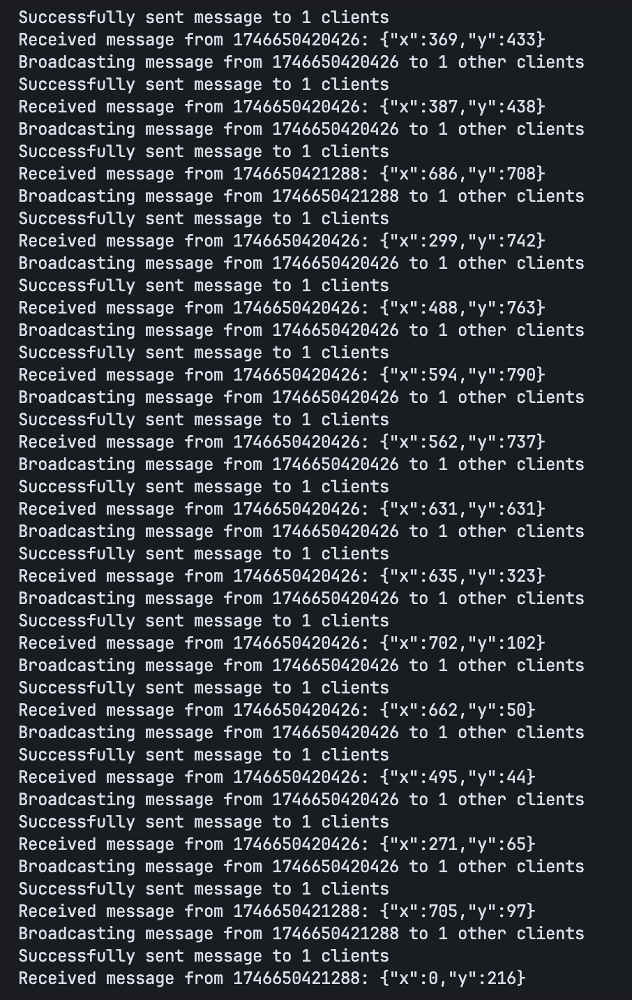

# Mouse-Share

**MouseShare** is a real-time collaborative mouse cursor sharing application that allows multiple users to see each other's mouse movements simultaneously across connected browsers.


## Features

- **Real-time cursor tracking** - See every connected user's cursor position with minimal latency
- **WebSocket-based communication** - Efficient, bi-directional communication between clients
- **Unique user identification** - Each connected client gets a unique ID and cursor color
- **Automatic reconnection** - Handles connection disruptions with intelligent retry mechanisms
- **Performance optimized** - Throttled mouse position updates to reduce network traffic
- **Visual indicators** - User labels and color-coded cursors for easy identification

## Architecture

### Server

The backend is built with:
- **Node.js** and **Express** - For the HTTP server
- **WebSocket (ws)** - For real-time bi-directional communication
- **TypeScript** - For type safety and improved developer experience

Server logs showing connection activity:


### Frontend

The frontend is built with:
- **Next.js** - React framework with server-side rendering capabilities
- **React** - For building the UI
- **TypeScript** - For type safety
- **Tailwind CSS** - For styling

## Getting Started

### Prerequisites

- Node.js (16.x or higher)
- Yarn or npm

### Installation

1. Clone the repository
   ```bash
   git clone https://github.com/sarvagyakrcs/mouse-share.git
   cd mouse-share
   ```

2. Install dependencies for both server and frontend
   ```bash
   # Install server dependencies
   cd server
   yarn install
   
   # Install frontend dependencies
   cd ../frontend
   yarn install
   ```

### Running the Application

1. Start the WebSocket server:
   ```bash
   cd server
   yarn start
   ```

2. Start the frontend development server:
   ```bash
   cd frontend
   yarn dev
   ```

3. Open your browser and navigate to `http://localhost:3000`

4. Open additional browser windows/tabs or devices to see cursor sharing in action

## How It Works

1. The server creates a WebSocket connection with each client
2. When a user moves their mouse, the position is sent to the server
3. The server broadcasts the position to all other connected clients
4. Each client renders the cursor positions of all other connected users
5. When a client disconnects, the server notifies all other clients to remove that cursor

## Configuration

- The WebSocket server runs on port 8080 by default (configurable via the PORT environment variable)
- The frontend connects to WebSocket server at the same host by default
- Maximum reconnect attempts and throttling values can be adjusted in the frontend code

## License

This project is licensed under the MIT License - see the LICENSE file for details. 